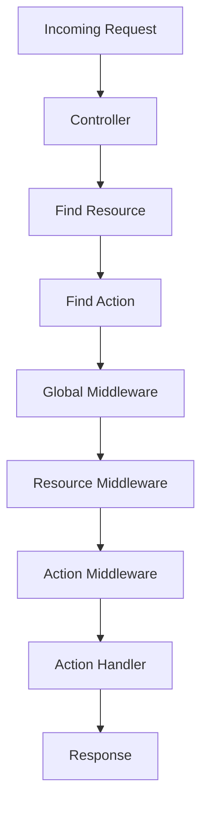
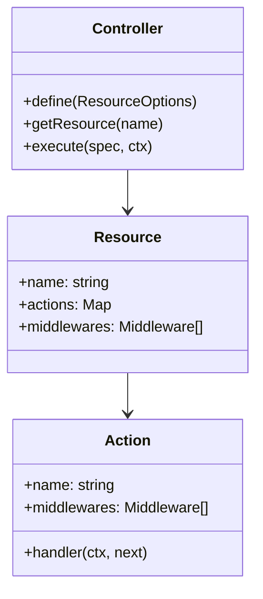
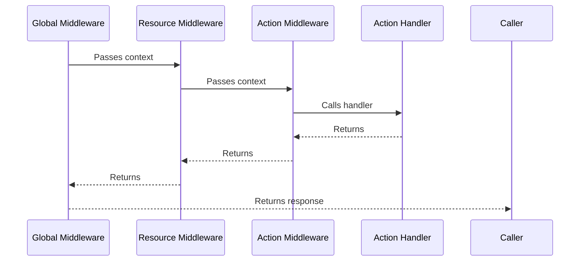
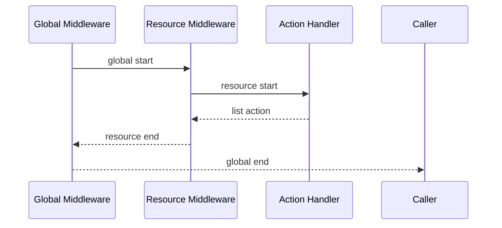
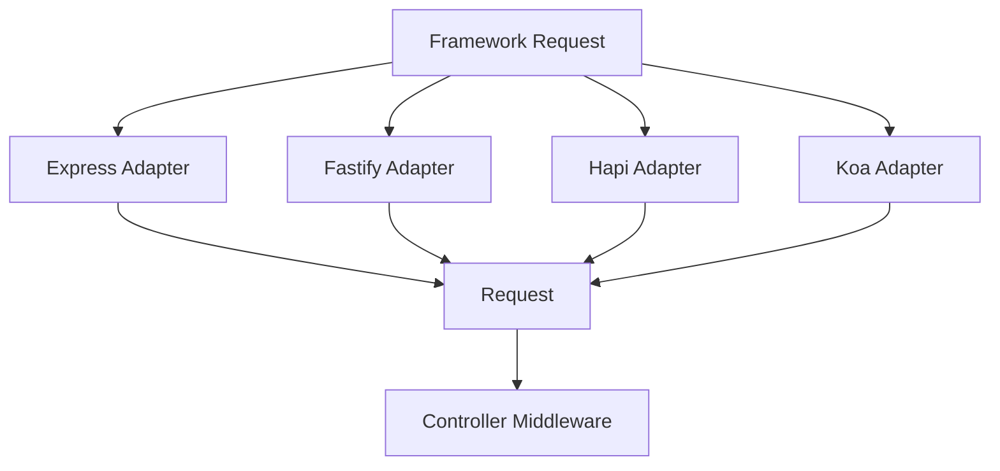

# Controller

The **Controller** is the central piece of this framework.
It organizes **resources**, their **actions**, and any **middlewares** that should run globally or per resource/action.
Adapters (`express`, `koa`, `hapi`, `fastify`) convert framework-specific requests into a standard `Request` object, which the Controller consumes.

---

## Core Concepts

* **Resource** → A logical grouping of actions (e.g. `users`, `posts`).
* **Action** → A single operation within a resource (e.g. `list`, `get`, `create`).
* **Middleware** → Functions that run before/after actions (global, per-resource, or per-action).
* **Controller** → The manager that ties everything together and executes actions.

### Request Flow



---

## Controller API

### Constructor

```ts
const controller = new Controller(options?: ControllerOptions, fileLoader?: FileLoader);
```

* **`options`**

  * `prefix?: string` → URL prefix for routing.
  * `accessors?: { list, create, get, update, delete }` → Customize default action names.
  * `logger?: Logger` → Optional logging abstraction.
* **`fileLoader`** (default: `NodeFileLoader`) → Controls how resources are loaded from disk.

---

### Defining Resources

```ts
controller.define({
  name: 'users',
  actions: {
    async list(ctx, next) {
      ctx.arr.push('list-users');
      await next();
    },
    async get(ctx, next) {
      ctx.arr.push('get-user');
      await next();
    },
  },
});
```

Diagram of **resource definition**:



---

### Global Action Handlers

```ts
controller.registerActionHandlers({
  async list(ctx, next) {
    ctx.arr.push('global-list');
    await next();
  },
  'users:get': async (ctx, next) => {
    ctx.arr.push('specific-get-for-users');
    await next();
  },
});
```

* `"list"` applies to all resources.
* `"resource:action"` applies only to that resource.

---

### Middlewares

Middleware layering follows this order:



#### Global

```ts
controller.use(async (ctx, next) => {
  ctx.arr.push('before-all');
  await next();
  ctx.arr.push('after-all');
});
```

#### Resource-level

```ts
controller.define({
  name: 'posts',
  middlewares: [
    async (ctx, next) => {
      ctx.arr.push('before-post');
      await next();
      ctx.arr.push('after-post');
    },
  ],
  actions: {
    async list(ctx, next) {
      ctx.arr.push('list-posts');
      await next();
    },
  },
});
```

#### Action-level

```ts
controller.define({
  name: 'comments',
  actions: {
    list: {
      middlewares: [
        async (ctx, next) => {
          ctx.arr.push('before-list-comments');
          await next();
          ctx.arr.push('after-list-comments');
        },
      ],
      async handler(ctx, next) {
        ctx.arr.push('list-comments');
        await next();
      },
    },
  },
});
```

---

### Executing Actions

```ts
await controller.execute(
  { resource: 'users', action: 'list' },
  { arr: [] } // context object
);
```

Execution order visualized:


---

### Importing Resources

Resources can be auto-loaded from a directory:

```ts
await controller.import({
  directory: path.resolve(__dirname, 'resources'),
  extensions: ['ts', 'js', 'json'], // optional
});
```

Each file should export either:

* A function returning a resource config.
* A plain object `ResourceOptions`.

---

## Example Flow

```ts
const controller = new Controller();

controller.use(async (ctx, next) => {
  console.log('global start');
  await next();
  console.log('global end');
});

controller.define({
  name: 'demo',
  middlewares: [
    async (ctx, next) => {
      console.log('resource start');
      await next();
      console.log('resource end');
    },
  ],
  actions: {
    async list(ctx, next) {
      console.log('list action');
      await next();
    },
  },
});

await controller.execute(
  { resource: 'demo', action: 'list' },
  {}
);
```

**Execution order (visualized):**



---

# Framework Adapters

Adapters normalize incoming framework requests into a standard **`Request`** object.
This allows the `Controller` to run independently of the web framework in use.

---

## Express Adapter

```ts
import express from "express";
import { expressAdapter } from "@paybilldev/controller";

app.use(async (req, res, next) => {
  const request = expressAdapter(req);
  await controller.middleware()(request, res, next);
});
```

---

## Fastify Adapter

```ts
import fastify from "fastify";
import { fastifyAdapter } from "@paybilldev/controller";

app.addHook("preHandler", async (req, reply) => {
  const request = fastifyAdapter(req);
  await controller.middleware()(request, reply);
});
```

---

## Hapi Adapter

```ts
import Hapi from "@hapi/hapi";
import { hapiAdapter } from "@paybilldev/controller";

server.ext("onRequest", async (req, h) => {
  const request = hapiAdapter(req);
  await controller.middleware()(request, h);
  return h.continue;
});
```

---

## Koa Adapter

```ts
import Koa from "koa";
import { koaAdapter } from "@paybilldev/controller";

app.use(async (ctx, next) => {
  const request = koaAdapter(ctx);
  await controller.middleware()(request, ctx, next);
});
```

---

## Request Normalization Flow



## License

AGPL

