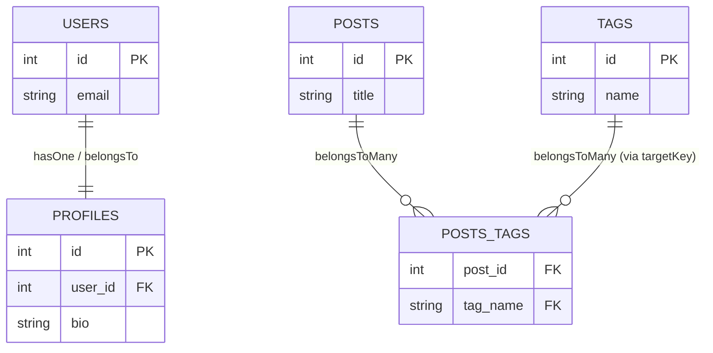

# Associations

Associations define relationships between collections (models) in the database.
This custom Sequelize-like implementation introduces two important concepts beyond the standard Sequelize API:

* **References**: how foreign key constraints are prioritized and enforced.
* **Target Keys**: how associations can point to non-primary columns.

---

## References

When you define associations, the system automatically creates **foreign key references** between collections.
Each reference has a **priority**:

* **`default`** – automatically applied if you don’t specify anything.
* **`user`** – applied if you explicitly set options like `onDelete: 'CASCADE'`. This lets you override the default schema behavior.

This distinction helps when you need fine-grained control over how associations behave on deletion or update.

### Example: default vs. user-defined references

```ts
// Default priority
db.collection({
  name: 'users',
  fields: [{ type: 'hasOne', name: 'profile' }],
});

// User-defined priority (with onDelete behavior)
db.collection({
  name: 'users',
  fields: [{ type: 'hasOne', name: 'profile', onDelete: 'CASCADE' }],
});
```

Here’s a visual overview of associations:



---

## Target Keys

By default, associations point to the **primary key** of the target model.
However, in some cases you want the join to reference a different unique field. That’s what the `targetKey` option is for.

The `targetKey` is most commonly used in `belongsToMany` associations to tell the join table which column on the target model it should reference.

### Example: many-to-many with custom `targetKey`

Here, the `posts_tags` join table will store `tag_name` values that reference the **`name` column** of the `tags` table (instead of its `id`).

```ts
db.collection({
  name: 'posts',
  fields: [
    { type: 'string', name: 'title' },
    {
      type: 'belongsToMany',
      name: 'tags',
      target: 'tags',
      through: 'posts_tags',
      sourceKey: 'id',
      foreignKey: 'post_id',
      otherKey: 'tag_name',
      targetKey: 'name', // 👈 use tag.name instead of tag.id
    },
  ],
});

db.collection({
  name: 'tags',
  fields: [{ type: 'string', name: 'name', unique: true }],
});
```

---

## Summary

* **References** let you control **foreign key behavior** with `default` and `user` priority.
* **Target Keys** let you associate models on **non-primary unique columns**.

Together, these features extend Sequelize’s association system with more control and flexibility over schema generation and relationship mapping.

