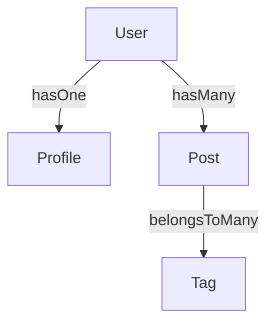

# Eager Loading

Eager loading is a powerful feature that allows you to load associated models along with the main model in a single query. This provides a robust eager loading mechanism that is both flexible and easy to use.

## Basic Eager Loading

You can eager load associations by using the `appends` option in your repository queries. This option takes an array of association names to be included in the result.

### Association Types

All major association types are supported:

- `hasOne`
- `belongsTo`
- `hasMany`
- `belongsToMany`

### Example

```ts
// Eager load the 'profile' for a user
const user = await User.repository.findOne({
  appends: ['profile'],
});

// Eager load the 'posts' for a user
const userWithPosts = await User.repository.findOne({
  appends: ['posts'],
});
```

## Nested Eager Loading

You can also eager load nested associations using dot notation. For example, if you have a `User` model with a `hasMany` association to `Post`, and `Post` has a `belongsToMany` association to `Tag`, you can load all of them like this:

```typescript
const user = await User.repository.findOne({
  appends: ['posts.tags'],
});
```

### Mermaid Visualization



This diagram shows:

* A `User` has one `Profile`.
* A `User` has many `Posts`.
* Each `Post` belongs to many `Tags`.

## Field Filtering

You can specify which fields to include in the eager-loaded models using the `fields` option. This is useful for optimizing your queries and reducing the amount of data transferred.

```typescript
const user = await User.repository.findOne({
  fields: ['name', 'profile.age'],
});
```

In this example, only the `name` of the user and the `age` of the profile will be fetched.

## Sorting

By default, `hasMany` and `belongsToMany` associations are sorted by the primary key of the target model. This ensures a consistent and predictable order for the associated records.
