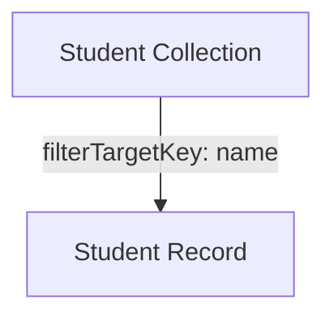
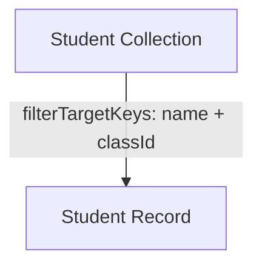

# Filter Target Key

The `filterTargetKey` option allows you to define a field or a set of fields that can be used to uniquely identify a record for filtering purposes. This is similar to a primary key, but it's used specifically for operations like `findOne`, `update`, and `destroy` where you want to target a single record.

## Single Filter Target Key

You can specify a single field as the `filterTargetKey`.

### Example

```typescript
const Student = db.collection({
  name: 'students',
  filterTargetKey: 'name',
  fields: [
    {
      name: 'name',
      type: 'string',
      primaryKey: true,
    },
    {
      name: 'age',
      type: 'integer',
    },
  ],
});

// Find a student by their name
const student = await Student.repository.findOne({
  filterByTk: 'josh',
});

// Update a student by their name
await Student.repository.update({
  filterByTk: 'josh',
  values: { age: 20 },
});
```

### Visualization: Single Filter Target Key



This shows that a single field (`name`) is used to uniquely identify each student record.

## Multiple Filter Target Keys

You can also specify an array of fields as the `filterTargetKey`. This is useful when a single field is not enough to uniquely identify a record.

### Example

```typescript
const Student = db.collection({
  name: 'students',
  filterTargetKey: ['name', 'classId'],
  fields: [
    {
      name: 'name',
      type: 'string',
      primaryKey: true,
    },
    {
      name: 'classId',
      type: 'bigInt',
      primaryKey: true,
    },
  ],
});

// Find a student by their name and classId
const student = await Student.repository.findOne({
  filterByTk: {
    name: 'josh',
    classId: 1,
  },
});
```

### Visualization: Multiple Filter Target Keys



This shows that multiple fields (`name` and `classId`) are used together to uniquely identify each student record.
