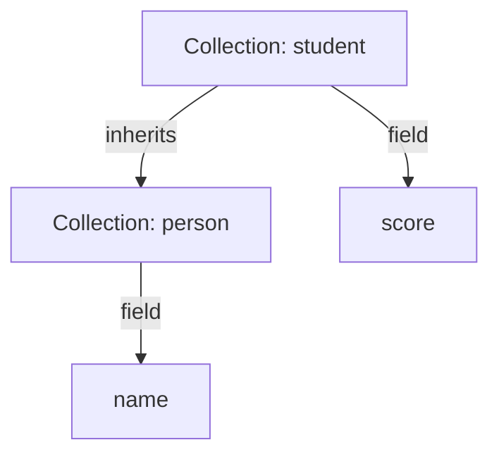
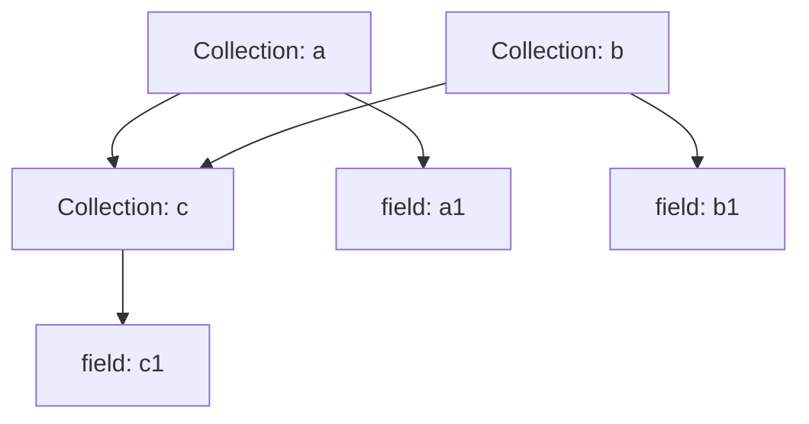
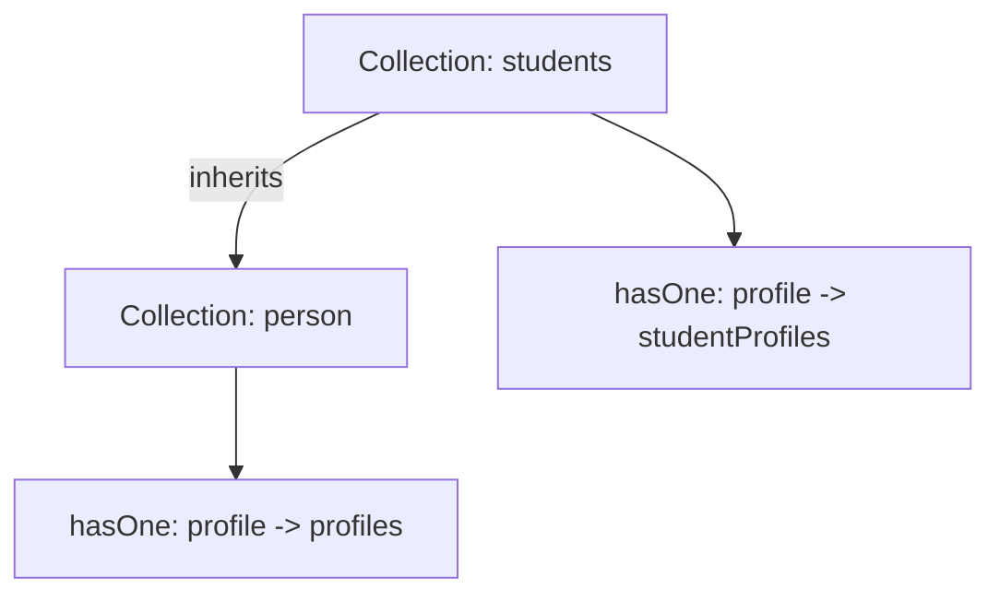

# Collection Inheritance

This provides a powerful collection inheritance feature that allows you to create new collections that inherit fields and associations from one or more parent collections. This is particularly useful for building complex data models and promoting reusability.

**Note:** This feature is currently only supported for the PostgreSQL dialect.

## Basic Inheritance

To create a collection that inherits from a parent, use the `inherits` option in the collection definition.

### Example

```typescript
// Define the parent collection
const person = db.collection({
  name: 'person',
  fields: [{ name: 'name', type: 'string' }],
});

// Define the child collection
const student = db.collection({
  name: 'student',
  inherits: 'person', // or ['person']
  fields: [{ name: 'score', type: 'integer' }],
});

await db.sync();

// The 'student' collection now has both 'name' and 'score' fields.
const student1 = await student.repository.create({
  values: {
    name: 'John Doe',
    score: 95,
  },
});
```

### Visualization: Basic Inheritance



## Multiple Inheritance

A collection can inherit from multiple parents.

```typescript
db.collection({
  name: 'a',
  fields: [{ type: 'string', name: 'a1' }],
});

db.collection({
  name: 'b',
  fields: [{ type: 'string', name: 'b1' }],
});

const c = db.collection({
  name: 'c',
  inherits: ['a', 'b'],
  fields: [{ type: 'string', name: 'c1' }],
});
```

### Visualization: Multiple Inheritance



## Overriding Fields and Associations

You can override fields and associations inherited from a parent collection by simply redefining them in the child collection.

```typescript
db.collection({
  name: 'person',
  fields: [
    { name: 'name', type: 'string' },
    { type: 'hasOne', name: 'profile', target: 'profiles' },
  ],
});

db.collection({
  name: 'students',
  inherits: 'person',
  fields: [
    // Override the 'profile' association to point to a different target
    { type: 'hasOne', name: 'profile', target: 'studentProfiles' },
  ],
});
```

### Visualization: Overriding Fields



## Querying Inherited Collections

When you query a parent collection, it will also return records from its child collections. A special `__collection` field is automatically included in the results to indicate the specific collection the record belongs to.

You can use the `__collection.$childIn` and `__collection.$childNotIn` filters to query for records of specific child types.

```typescript
// Find all records in the 'root' collection that are of type 'child1'
const records = await rootCollection.repository.find({
  filter: {
    '__collection.$childIn': ['child1'],
  },
});
```
