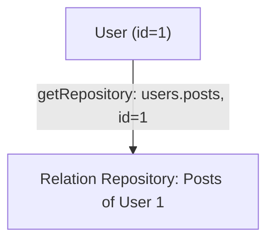
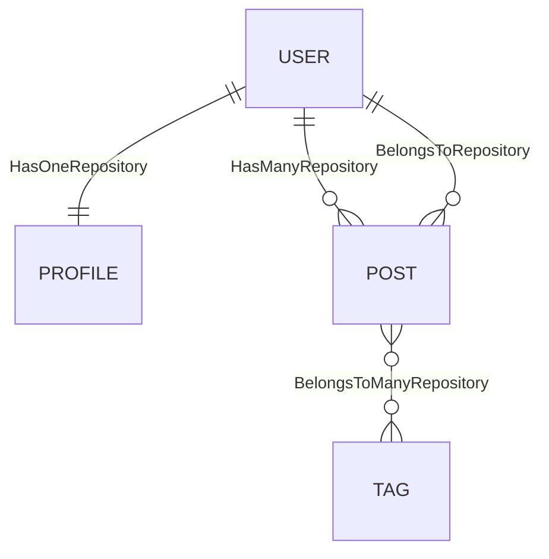

# Relation Repository

A relation repository is a repository that is scoped to a specific relationship on a specific record. It provides a convenient way to perform CRUD operations on related records without having to manually manage foreign keys.

## Getting a Relation Repository

You can get a relation repository by calling `db.getRepository()` with the path to the relation and the ID of the source record.

```typescript
// Get the repository for the 'posts' of a user with ID 1
const userPostsRepo = db.getRepository('users.posts', 1);
```




The specific type of repository returned depends on the type of the relationship:

* `HasOneRepository`
* `BelongsToRepository`
* `HasManyRepository`
* `BelongsToManyRepository`

---

## Common Methods

All relation repositories support the standard repository methods like `find`, `findOne`, `create`, `update`, and `destroy`.

### `firstOrCreate(options)`

This method is available on `HasOneRepository`, `BelongsToRepository`, and `HasManyRepository`. It finds the first record that matches the `filterKeys` or creates a new one if no match is found.

* `options.filterKeys`: An array of field names to use for finding the record.
* `options.values`: The values to use for creating the record if it doesn't exist.

### `updateOrCreate(options)`

Similar to `firstOrCreate`, but it updates the record if it's found, instead of doing nothing.

---



* A **user** has one profile (HasOneRepository).
* A **post** belongs to a user (BelongsToRepository).
* A **user** has many posts (HasManyRepository).
* A **post** belongs to many tags (BelongsToManyRepository).

---

## `BelongsToManyRepository` Methods

`BelongsToManyRepository` has some additional methods for managing the relationship:

* **`add(pks)`**: Adds one or more records to the relationship. You can also pass through attributes.
* **`set(pks)`**: Sets the associated records to the given primary keys, removing any existing associations.
* **`toggle(pks)`**: Adds or removes records from the relationship.
* **`remove(pks)`**: Removes records from the relationship.

---

## Eager Loading

You can use the `appends` option to eager load nested associations when querying a relation repository.

```typescript
const user = await repository.findOne({
  appends: ['posts'],
});
```

---

## Filter Target Key

Relation repositories also work with `filterTargetKey`, allowing you to identify records using a custom key instead of the primary key.
