# Repository

The repository is the primary interface for interacting with your collections. It provides a high-level, developer-friendly API for performing CRUD (Create, Read, Update, Delete) operations and more.

## Getting a Repository

You can get a repository for a collection using `db.getRepository('collectionName')`.

```ts
const userRepository = db.getRepository('users');
```

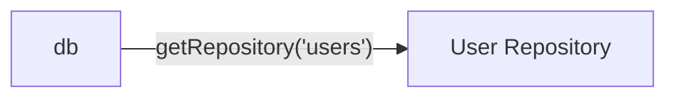

## CRUD Operations

### `create(options)`

Creates a single record.

```ts
await userRepository.create({
  values: { name: 'Alice', age: 25 },
});
```

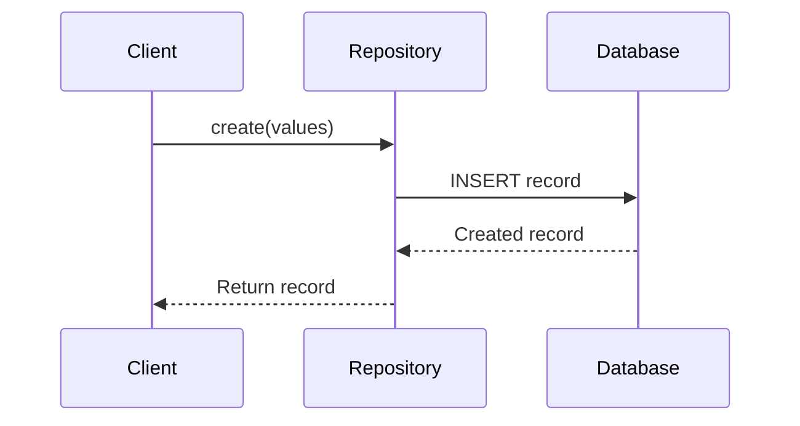

---

### `createMany(options)`

```ts
await userRepository.createMany({
  records: [
    { name: 'Bob', age: 30 },
    { name: 'Carol', age: 40 },
  ],
});
```

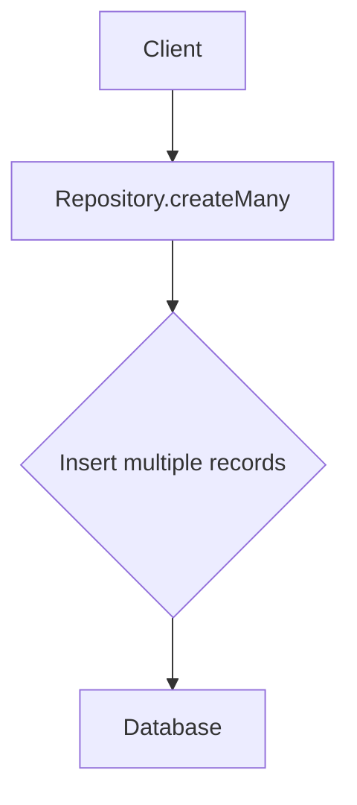

---

### `find(options)`

```ts
const users = await userRepository.find({
  filter: { 'age.$gt': 20 },
  sort: ['-age'],
  limit: 10,
  appends: ['posts'],
});
```

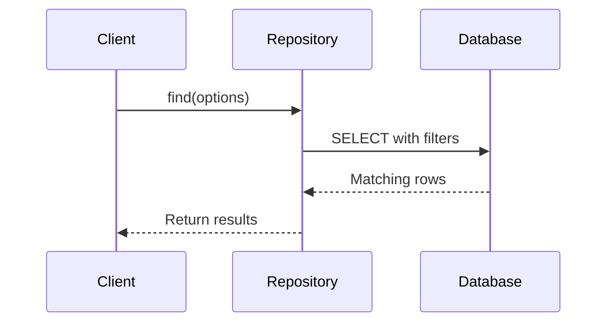

---

### `findOne(options)`

```ts
const user = await userRepository.findOne({
  filter: { name: 'Alice' },
});
```

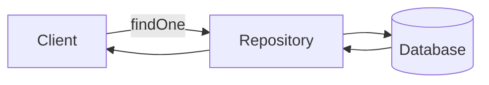

---

### `update(options)`

```ts
await userRepository.update({
  values: { age: 26 },
  filter: { name: 'Alice' },
});
```

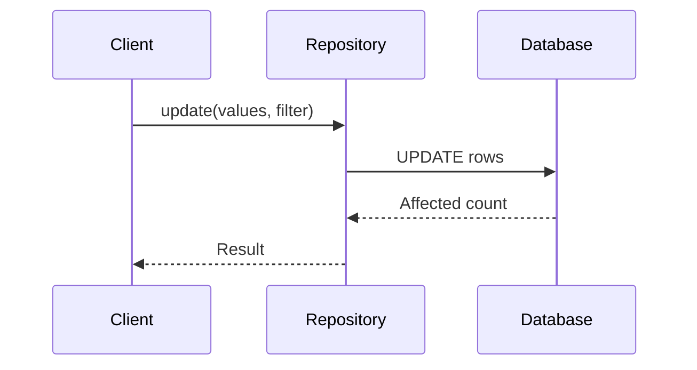

---

### `updateMany(options)`

```ts
await userRepository.updateMany({
  values: [
    { id: 1, age: 27 },
    { id: 2, age: 35 },
  ],
});
```

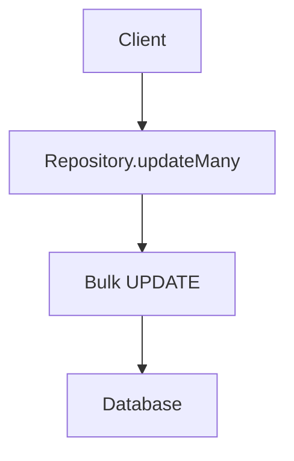

---

### `destroy(options)`

```ts
await userRepository.destroy({ filterByTk: 1 });
await userRepository.destroy({ filter: { 'age.$gt': 40 } });
await userRepository.destroy({ truncate: true });
```

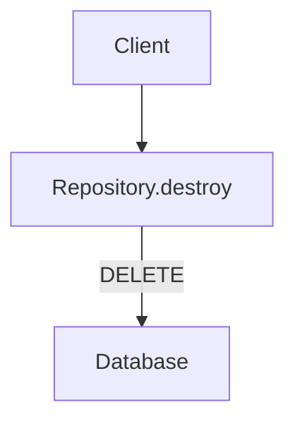

---

## Upserting

### `firstOrCreate(options)`

```ts
const user = await userRepository.firstOrCreate({
  filterKeys: ['email'],
  values: { email: 'test@example.com', name: 'Test User' },
});
```

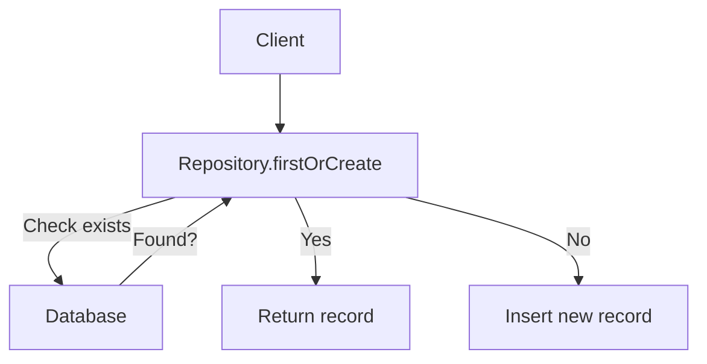

---

### `updateOrCreate(options)`

```ts
const user = await userRepository.updateOrCreate({
  filterKeys: ['email'],
  values: { email: 'test@example.com', name: 'Updated User' },
});
```

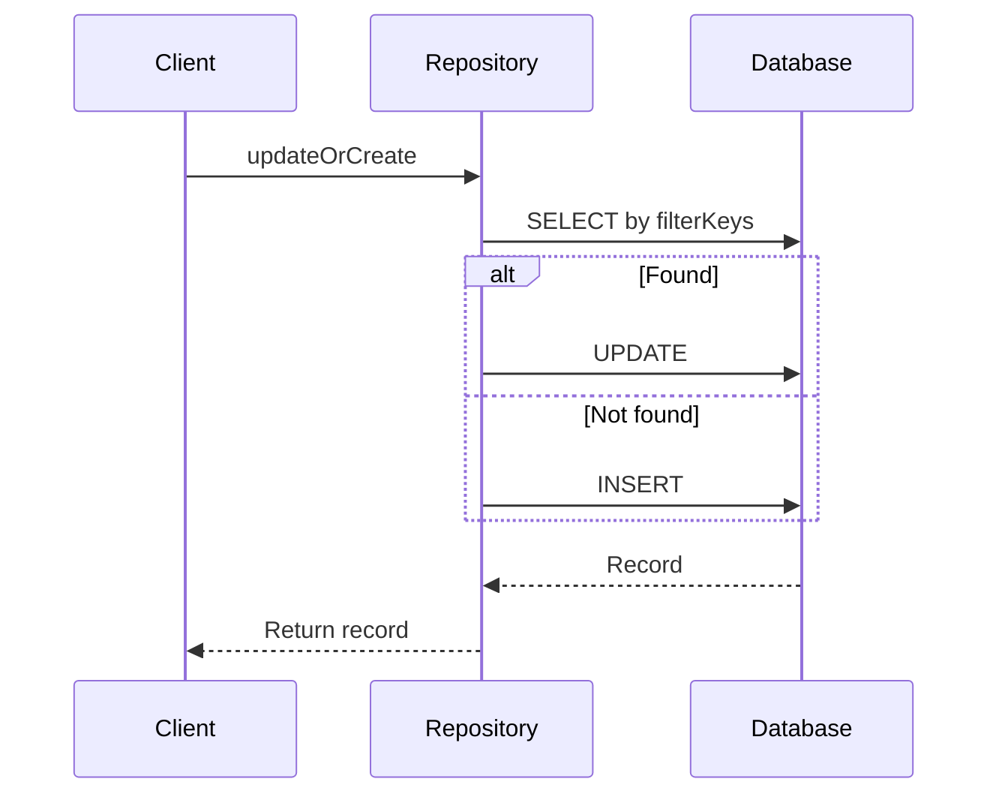

---

## Other Methods

### `count(options)`

```ts
const count = await userRepository.count({
  filter: { 'age.$gte': 18 },
});
```

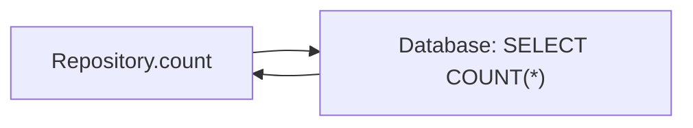

---

### `getEstimatedRowCount()`

```ts
const estimated = await userRepository.getEstimatedRowCount();
```

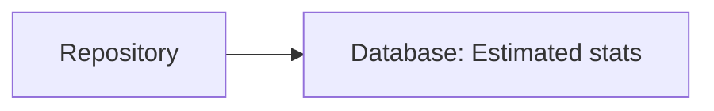

---

### `aggregate(options)`

```ts
const avgAge = await userRepository.aggregate({
  method: 'avg',
  field: 'age',
});
```

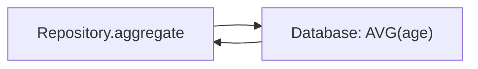

---

### `chunk(options)`

```ts
await userRepository.chunk({
  chunkSize: 100,
  callback: async (users) => {
    console.log('Processing chunk:', users.length);
  },
  limit: 1000,
});
```

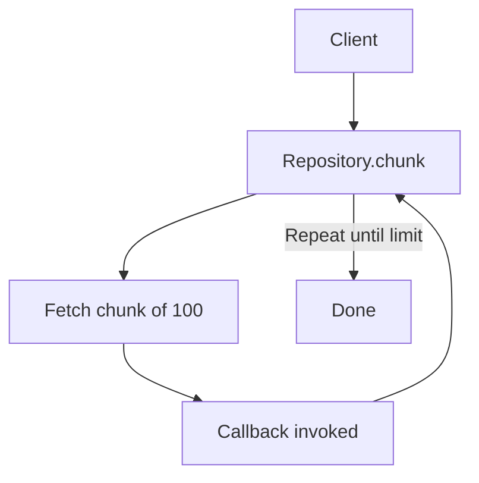
