<p align="center">
  <a href="https://paybilldev" target="blank"></a>
</p>

<p align="center">
  Paybill is an open-source Saleforce Alternative for developing cloud-native enterprise applications, utilizing prebuilt standardized architectures for deployment on private and public clouds.
</p>

# @paybilldev/sequelize

[![NPM version][npm-image]][npm-url]
[![npm download][download-image]][download-url]
[](https://nodejs.org/en/download/)
[](https://makeapullrequest.com)


[npm-image]: https://img.shields.io/npm/v/@paybilldev/sequelize.svg?style=flat-square
[npm-url]: https://npmjs.org/package/@paybilldev/sequelize
[download-image]: https://img.shields.io/npm/dm/@paybilldev/sequelize.svg?style=flat-square
[download-url]: https://npmjs.org/package/@paybilldev/sequelize

# Introduction

To begin using this database system in your application, you create a new instance of the `Database` class by calling `new Database(options)`. This gives you full control over your database connection, dialect, and behavior—whether you're using **SQLite**, **MySQL**, or **PostgreSQL**.

## Basic Setup

First, import the `Database` class:

```ts
import { Database } from '@paybilldev/sequelize';
```

Then instantiate it with your desired configuration:

```ts
const db = new Database({
  dialect: 'sqlite',
  storage: ':memory:', // or './app.db' for file-based SQLite
});
```

This creates an in-memory SQLite database—ideal for development or testing.

## Connecting to Real Databases

### SQLite (File or Memory)
```ts
const db = new Database({
  dialect: 'sqlite',
  storage: './my-app.db', // persists to disk
});
```

### MySQL
```ts
const db = new Database({
  dialect: 'mysql',
  host: '127.0.0.1',
  port: 3306,
  username: 'root',
  password: 'password',
  database: 'my_app',
});
```

### PostgreSQL
```ts
const db = new Database({
  dialect: 'postgres',
  host: '127.0.0.1',
  port: 5432,
  username: 'postgres',
  password: 'postgres',
  database: 'my_app',
  // Optional: use a custom schema
  schema: 'my_app_schema',
});
```

> 💡 **Note**: The system automatically handles PostgreSQL schema creation if it doesn’t exist when you call `db.sync()` or `db.prepare()`.

## Common Options

| Option | Description |
| ------ | ----------- |
| `tablePrefix` | Prefixes all table names (e.g., `app_users`) |
| `underscored` | Converts `camelCase` field names to `snake_case` in the database |
| `usingBigIntForId` | Uses `BIGINT` instead of `INTEGER` for auto-increment IDs (default: `true`) |
| `instanceId` | Assign a custom ID for logging and debugging |
| `logger` | Custom logger (defaults to `console`) |

Example with options:
```ts
const db = new Database({
  dialect: 'postgres',
  database: 'production_db',
  tablePrefix: 'prod_',
  underscored: true,
  instanceId: 'main-app-db',
});
```

## Initialize and Sync

After creating the `db` instance:

1. **Define your collections**:
   ```ts
   const User = db.collection({
     name: 'users',
     fields: [
       { name: 'name', type: 'string' },
       { name: 'email', type: 'string', unique: true },
     ],
   });
   ```

2. **Prepare and sync the schema**:
   ```ts
   await db.prepare(); // Optional: checks DB compatibility
   await db.sync();    // Creates/updates tables
   ```

3. **Use repositories to interact with data**:
   ```ts
   const user = await User.repository.create({
     values: { name: 'Alice', email: 'alice@example.com' }
   });
   ```

## Next Steps

- Explore [**Database Synchronization**](#database-synchronization) to understand how schema changes are applied.
- Learn about [**Repositories**](#repository) for CRUD operations.
- Use [**Relations**](#relation-repository) and [**Eager Loading**](#eager-loading-1) to model complex data.

## Table of Contents

- [Database Synchronization](#database-synchronization)
  - [Basic Usage](#basic-usage)
  - [How it Works](#how-it-works)
  - [Sync Options](#sync-options)
- [Repository](#repository)
  - [Getting a Repository](#getting-a-repository)
  - [CRUD Operations](#crud-operations)
    - [`create(options)`](#createoptions)
    - [`createMany(options)`](#createmanyoptions)
    - [`find(options)`](#findoptions)
    - [`findOne(options)`](#findoneoptions)
    - [`update(options)`](#updateoptions)
    - [`updateMany(options)`](#updatemanyoptions)
    - [`destroy(options)`](#destroyoptions)
  - [Upserting](#upserting)
    - [`firstOrCreate(options)`](#firstorcreateoptions)
    - [`updateOrCreate(options)`](#updateorcreateoptions)
  - [Other Methods](#other-methods)
    - [`count(options)`](#countoptions)
    - [`getEstimatedRowCount()`](#getestimatedrowcount)
    - [`aggregate(options)`](#aggregateoptions)
    - [`chunk(options)`](#chunkoptions)
- [Relation Repository](#relation-repository)
  - [Getting a Relation Repository](#getting-a-relation-repository)
  - [Common Methods](#common-methods)
  - [`BelongsToManyRepository` Methods](#belongstomanyrepository-methods)
  - [Eager Loading](#eager-loading)
  - [Filter Target Key](#filter-target-key)
- [Eager Loading](#eager-loading-1)
  - [Basic Eager Loading](#basic-eager-loading)
  - [Nested Eager Loading](#nested-eager-loading)
  - [Field Filtering](#field-filtering)
  - [Sorting](#sorting)
- [Filter Target Key](#filter-target-key-1)
  - [Single Filter Target Key](#single-filter-target-key)
  - [Multiple Filter Target Keys](#multiple-filter-target-keys)
- [Filter Operators](#filter-operators)
  - [Generic Operators](#generic-operators)
  - [String Operators](#string-operators)
  - [Array Operators](#array-operators)
  - [Association Operators](#association-operators)
  - [Boolean Operators](#boolean-operators)
  - [Date Operators](#date-operators)
  - [Example of Implementation](#example-of-implementation)
- [Fields](#fields)
  - [Standard Types](#standard-types)
  - [ID and Hashing](#id-and-hashing)
  - [Date and Time](#date-and-time)
  - [Relationships](#relationships)
  - [Special](#special)
- [Field Repository](#field-repository)
  - [Usage](#usage)
  - [Methods](#methods)
- [Field Interfaces](#field-interfaces)
  - [Core Concepts](#core-concepts)
  - [Available Interfaces](#available-interfaces)
    - [Primitive / Basic Interfaces](#primitive--basic-interfaces)
    - [Date & Time Interfaces](#date--time-interfaces)
    - [Select / Multiple Choice Interfaces](#select--multiple-choice-interfaces)
    - [JSON Interface](#json-interface)
    - [Relationship Interfaces](#relationship-interfaces)
  - [Custom Interfaces](#custom-interfaces)
- [Associations](#associations)
  - [References](#references)
  - [Target Keys](#target-keys)
  - [Summary](#summary)
- [Collection Inheritance](#collection-inheritance)
  - [Basic Inheritance](#basic-inheritance)
  - [Multiple Inheritance](#multiple-inheritance)
  - [Overriding Fields and Associations](#overriding-fields-and-associations)
  - [Querying Inherited Collections](#querying-inherited-collections)
- [Hooks](#hooks)
  - [Listening to Hooks](#listening-to-hooks)
  - [Available Hooks](#available-hooks)
- [Query Interface Extensions](#query-interface-extensions)
  - [`showTableDefinition(options)`](#showtabledefinitionoptions)
  - [`getAutoIncrementInfo(options)`](#getautoincrementinfooptions)
  - [`setAutoIncrementVal(options)`](#setautoincrementvaloptions)
  - [When to Use These Methods](#when-to-use-these-methods)
- [PostgreSQL Schemas](#postgresql-schemas)
  - [Specifying a Schema](#specifying-a-schema)
  - [Automatic Schema Creation](#automatic-schema-creation)
  - [Collection Scoping](#collection-scoping)
  - [Cleaning a Schema](#cleaning-a-schema)
- [Dialect Extend](#dialect-extend)
  - [Registering a Custom Dialect](#registering-a-custom-dialect)
- [Miscellaneous Topics](#miscellaneous-topics)
  - [BigInt Support](#bigint-support)
  - [Collection Factory](#collection-factory)
  - [Collection Importer](#collection-importer)
  - [Database Operations](#database-operations)
  - [Filtering](#filtering)
  - [Grouping](#grouping)
  - [Magic Attribute Model](#magic-attribute-model)
  - [Migrations](#migrations)
  - [Sorting](#sorting-1)
  - [Underscored Option](#underscored-option)
  - [Update Guard](#update-guard)


# Database Synchronization

The `db.sync()` method is a powerful tool that synchronizes your database schema with your collection definitions. It handles the creation and modification of tables, columns, indexes, and constraints.

## Basic Usage

To synchronize all collections with the database, simply call `db.sync()`.

```typescript
await db.sync();
```

## How it Works

When you call `db.sync()`, it compares the state of your collections with the state of the database and applies the necessary changes. This includes:

-   **Creating Tables**: If a collection's table doesn't exist in the database, `db.sync()` will create it.
-   **Adding Columns**: If you add a new field to a collection, `db.sync()` will add a corresponding column to the table.
-   **Modifying Columns**: If you change a field's definition (e.g., change its type or default value), `db.sync()` will update the column in the database.
-   **Removing Columns**: If you remove a field from a collection, `db.sync()` will remove the corresponding column from the table.
-   **Managing Indexes**: It creates, modifies, and removes indexes, including unique indexes and indexes for foreign keys.
-   **Managing Primary Keys**: It can set and change the primary key of a table.

## Sync Options

You can pass an options object to `db.sync()` to control its behavior.

```typescript
await db.sync({
  force: false,
  alter: {
    drop: false,
  },
});
```

-   **`force`**: If `true`, it will drop all tables and recreate them. **Warning: This will delete all your data.**
-   **`alter.drop`**: If `false`, it will not drop columns that have been removed from the collection definition.

---

# Repository

The repository is the primary interface for interacting with your collections. It provides a high-level, developer-friendly API for performing CRUD (Create, Read, Update, Delete) operations and more.

## Getting a Repository

You can get a repository for a collection using `db.getRepository('collectionName')`.

```ts
const userRepository = db.getRepository('users');
```

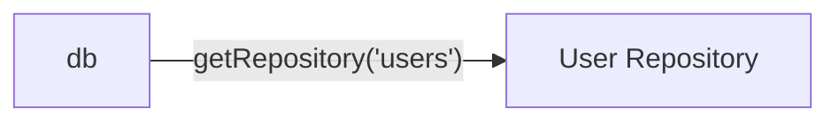

## CRUD Operations

### `create(options)`

Creates a single record.

```ts
await userRepository.create({
  values: { name: 'Alice', age: 25 },
});
```

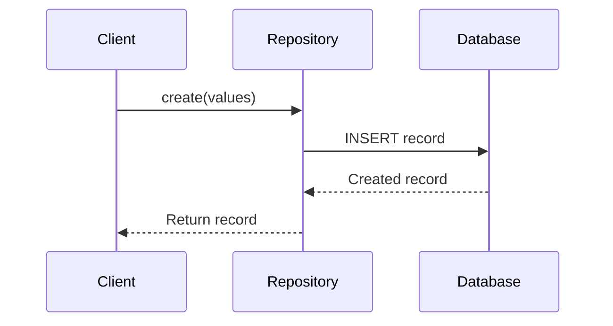

---

### `createMany(options)`

```ts
await userRepository.createMany({
  records: [
    { name: 'Bob', age: 30 },
    { name: 'Carol', age: 40 },
  ],
});
```

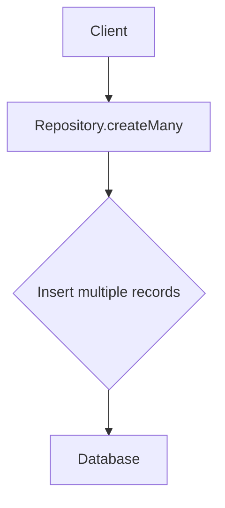

---

### `find(options)`

```ts
const users = await userRepository.find({
  filter: { 'age.$gt': 20 },
  sort: ['-age'],
  limit: 10,
  appends: ['posts'],
});
```

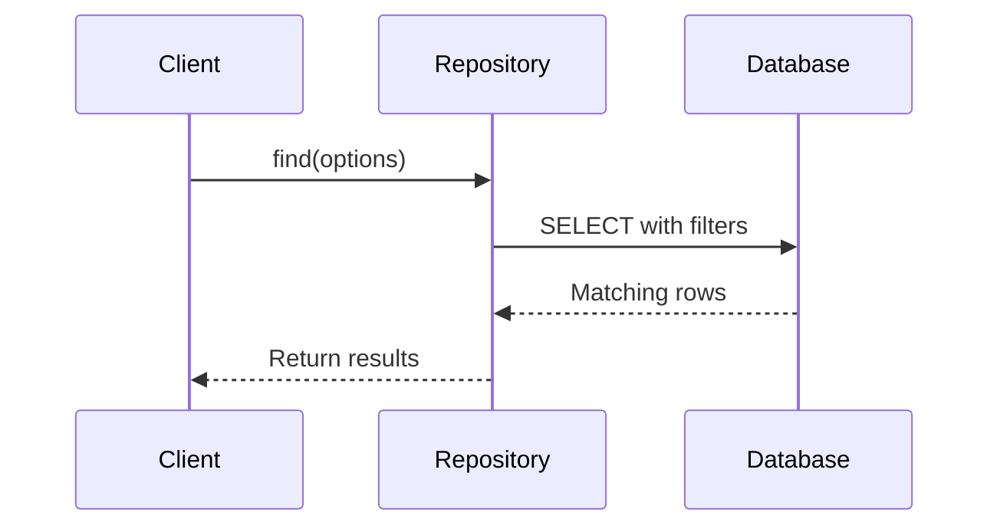

---

### `findOne(options)`

```ts
const user = await userRepository.findOne({
  filter: { name: 'Alice' },
});
```

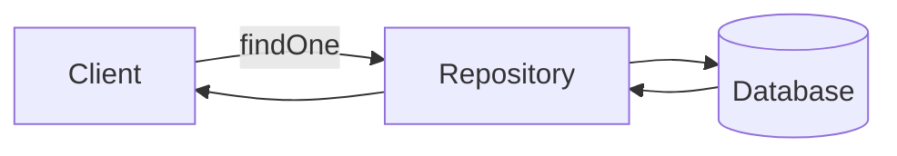

---

### `update(options)`

```ts
await userRepository.update({
  values: { age: 26 },
  filter: { name: 'Alice' },
});
```

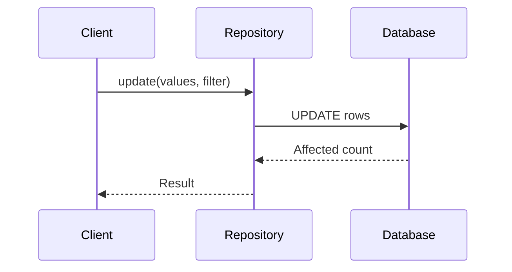

---

### `updateMany(options)`

```ts
await userRepository.updateMany({
  values: [
    { id: 1, age: 27 },
    { id: 2, age: 35 },
  ],
});
```

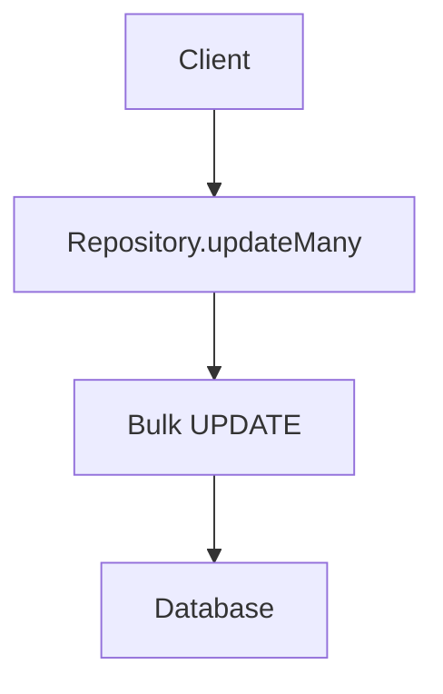

---

### `destroy(options)`

```ts
await userRepository.destroy({ filterByTk: 1 });
await userRepository.destroy({ filter: { 'age.$gt': 40 } });
await userRepository.destroy({ truncate: true });
```

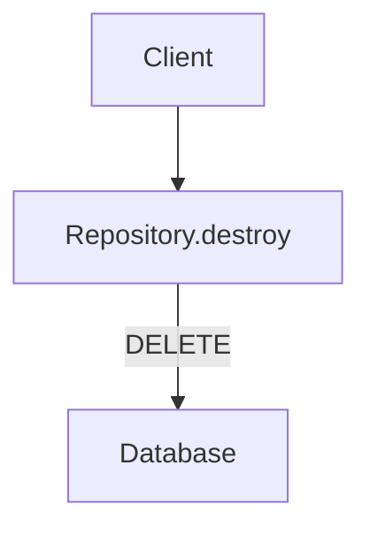

---

## Upserting

### `firstOrCreate(options)`

```ts
const user = await userRepository.firstOrCreate({
  filterKeys: ['email'],
  values: { email: 'test@example.com', name: 'Test User' },
});
```

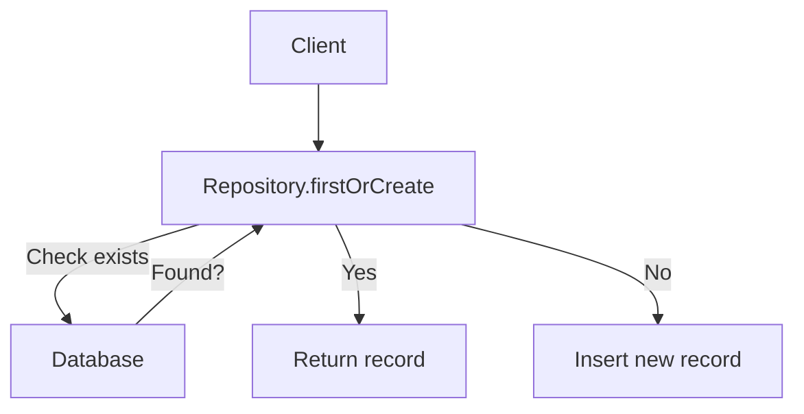

---

### `updateOrCreate(options)`

```ts
const user = await userRepository.updateOrCreate({
  filterKeys: ['email'],
  values: { email: 'test@example.com', name: 'Updated User' },
});
```

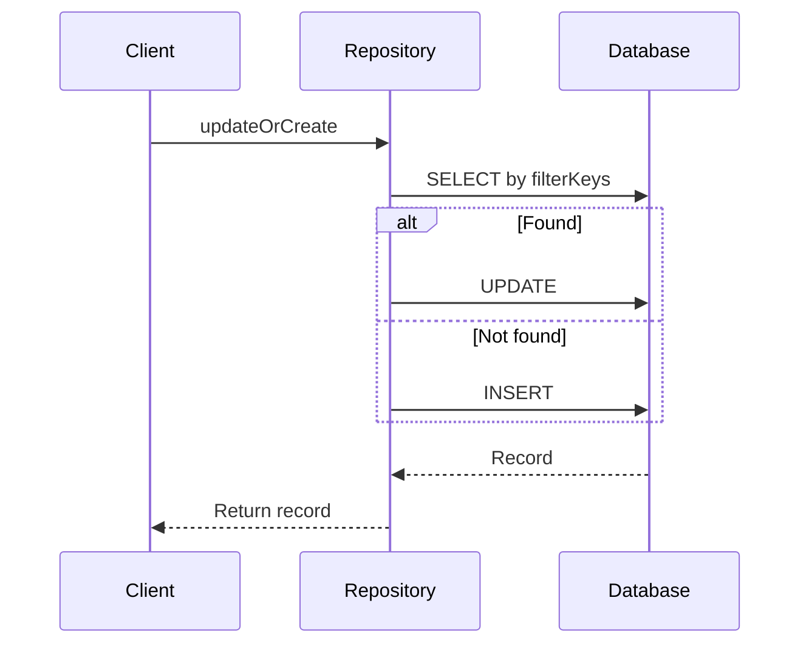

---

## Other Methods

### `count(options)`

```ts
const count = await userRepository.count({
  filter: { 'age.$gte': 18 },
});
```

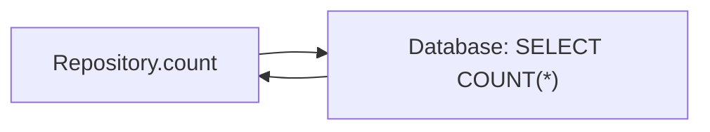

---

### `getEstimatedRowCount()`

```ts
const estimated = await userRepository.getEstimatedRowCount();
```

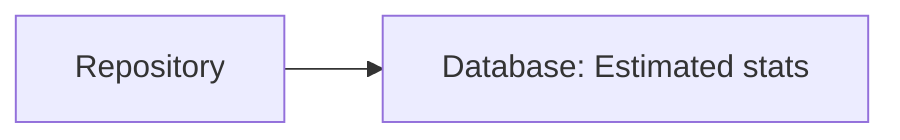

---

### `aggregate(options)`

```ts
const avgAge = await userRepository.aggregate({
  method: 'avg',
  field: 'age',
});
```

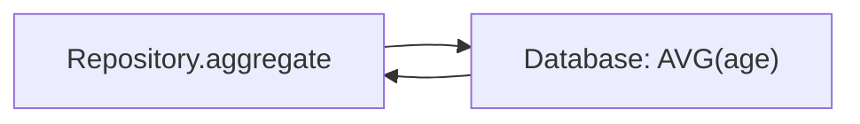

---

### `chunk(options)`

```ts
await userRepository.chunk({
  chunkSize: 100,
  callback: async (users) => {
    console.log('Processing chunk:', users.length);
  },
  limit: 1000,
});
```

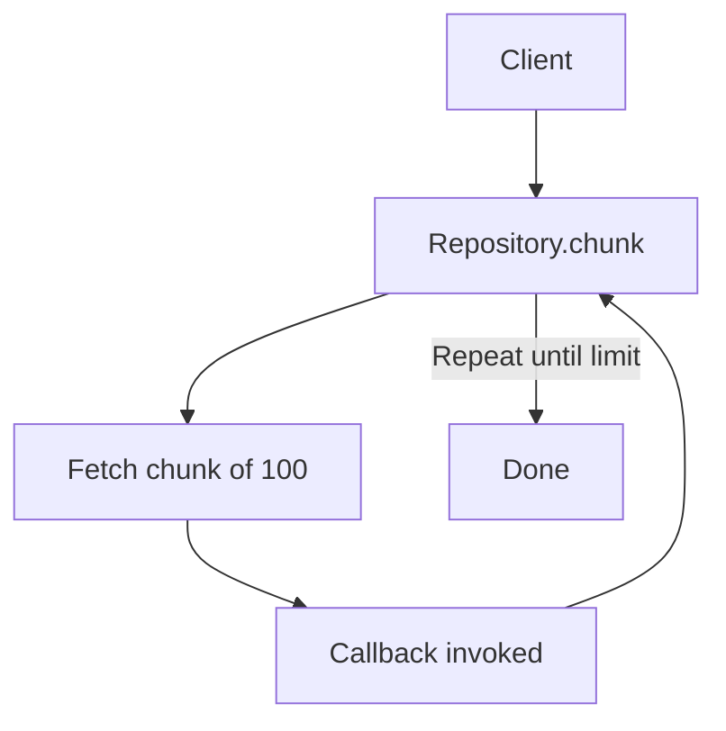

---

# Relation Repository

A relation repository is a repository that is scoped to a specific relationship on a specific record. It provides a convenient way to perform CRUD operations on related records without having to manually manage foreign keys.

## Getting a Relation Repository

You can get a relation repository by calling `db.getRepository()` with the path to the relation and the ID of the source record.

```typescript
// Get the repository for the 'posts' of a user with ID 1
const userPostsRepo = db.getRepository('users.posts', 1);
```

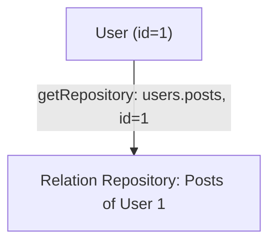

The specific type of repository returned depends on the type of the relationship:

* `HasOneRepository`
* `BelongsToRepository`
* `HasManyRepository`
* `BelongsToManyRepository`

---

## Common Methods

All relation repositories support the standard repository methods like `find`, `findOne`, `create`, `update`, and `destroy`.

### `firstOrCreate(options)`

This method is available on `HasOneRepository`, `BelongsToRepository`, and `HasManyRepository`. It finds the first record that matches the `filterKeys` or creates a new one if no match is found.

* `options.filterKeys`: An array of field names to use for finding the record.
* `options.values`: The values to use for creating the record if it doesn't exist.

### `updateOrCreate(options)`

Similar to `firstOrCreate`, but it updates the record if it's found, instead of doing nothing.

---

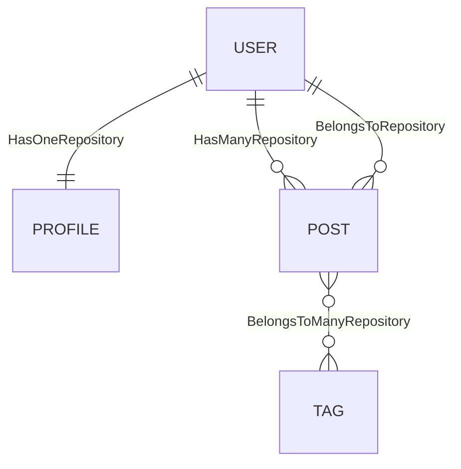

* A **user** has one profile (HasOneRepository).
* A **post** belongs to a user (BelongsToRepository).
* A **user** has many posts (HasManyRepository).
* A **post** belongs to many tags (BelongsToManyRepository).

---

## `BelongsToManyRepository` Methods

`BelongsToManyRepository` has some additional methods for managing the relationship:

* **`add(pks)`**: Adds one or more records to the relationship. You can also pass through attributes.
* **`set(pks)`**: Sets the associated records to the given primary keys, removing any existing associations.
* **`toggle(pks)`**: Adds or removes records from the relationship.
* **`remove(pks)`**: Removes records from the relationship.

---

## Eager Loading

You can use the `appends` option to eager load nested associations when querying a relation repository.

```typescript
const user = await repository.findOne({
  appends: ['posts'],
});
```

---

## Filter Target Key

Relation repositories also work with `filterTargetKey`, allowing you to identify records using a custom key instead of the primary key.

---

# Eager Loading

Eager loading is a powerful feature that allows you to load associated models along with the main model in a single query. This provides a robust eager loading mechanism that is both flexible and easy to use.

## Basic Eager Loading

You can eager load associations by using the `appends` option in your repository queries. This option takes an array of association names to be included in the result.

### Association Types

All major association types are supported:

- `hasOne`
- `belongsTo`
- `hasMany`
- `belongsToMany`

### Example

```ts
// Eager load the 'profile' for a user
const user = await User.repository.findOne({
  appends: ['profile'],
});
// Eager load the 'posts' for a user
const userWithPosts = await User.repository.findOne({
  appends: ['posts'],
});
```

## Nested Eager Loading

You can also eager load nested associations using dot notation. For example, if you have a `User` model with a `hasMany` association to `Post`, and `Post` has a `belongsToMany` association to `Tag`, you can load all of them like this:

```typescript
const user = await User.repository.findOne({
  appends: ['posts.tags'],
});
```

### Mermaid Visualization

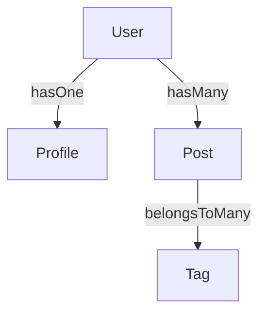

This diagram shows:

* A `User` has one `Profile`.
* A `User` has many `Posts`.
* Each `Post` belongs to many `Tags`.

## Field Filtering

You can specify which fields to include in the eager-loaded models using the `fields` option. This is useful for optimizing your queries and reducing the amount of data transferred.

```typescript
const user = await User.repository.findOne({
  fields: ['name', 'profile.age'],
});
```

In this example, only the `name` of the user and the `age` of the profile will be fetched.

## Sorting

By default, `hasMany` and `belongsToMany` associations are sorted by the primary key of the target model. This ensures a consistent and predictable order for the associated records.

---

# Filter Target Key

The `filterTargetKey` option allows you to define a field or a set of fields that can be used to uniquely identify a record for filtering purposes. This is similar to a primary key, but it's used specifically for operations like `findOne`, `update`, and `destroy` where you want to target a single record.

## Single Filter Target Key

You can specify a single field as the `filterTargetKey`.

### Example

```typescript
const Student = db.collection({
  name: 'students',
  filterTargetKey: 'name',
  fields: [
    {
      name: 'name',
      type: 'string',
      primaryKey: true,
    },
    {
      name: 'age',
      type: 'integer',
    },
  ],
});
// Find a student by their name
const student = await Student.repository.findOne({
  filterByTk: 'josh',
});
// Update a student by their name
await Student.repository.update({
  filterByTk: 'josh',
  values: { age: 20 },
});
```

### Visualization: Single Filter Target Key

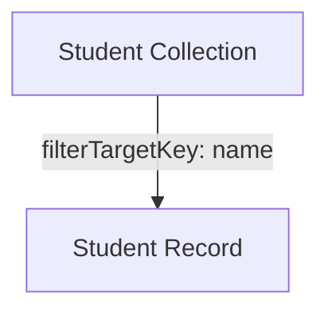

This shows that a single field (`name`) is used to uniquely identify each student record.

## Multiple Filter Target Keys

You can also specify an array of fields as the `filterTargetKey`. This is useful when a single field is not enough to uniquely identify a record.

### Example

```typescript
const Student = db.collection({
  name: 'students',
  filterTargetKey: ['name', 'classId'],
  fields: [
    {
      name: 'name',
      type: 'string',
      primaryKey: true,
    },
    {
      name: 'classId',
      type: 'bigInt',
      primaryKey: true,
    },
  ],
});
// Find a student by their name and classId
const student = await Student.repository.findOne({
  filterByTk: {
    name: 'josh',
    classId: 1,
  },
});
```

### Visualization: Multiple Filter Target Keys

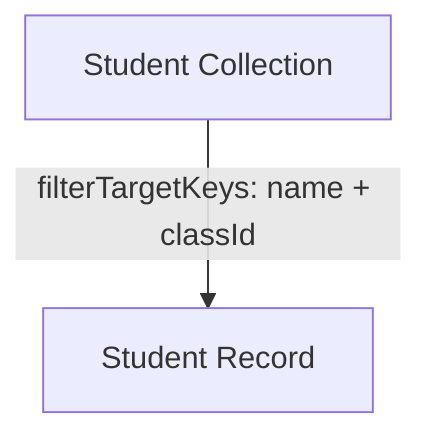

This shows that multiple fields (`name` and `classId`) are used together to uniquely identify each student record.

---

# Filter Operators

This provides a rich set of filter operators that you can use to build complex queries.

## Generic Operators

| Operator | Description             | Example                                   |
| -------- | ----------------------- | ----------------------------------------- |
| `$eq`    | Equal to                | `{ 'name.$eq': 'John' }`                  |
| `$ne`    | Not equal to            | `{ 'age.$ne': 21 }`                       |
| `$in`    | In a list of values     | `{ 'status.$in': ['active', 'pending'] }` |
| `$notIn` | Not in a list of values | `{ 'country.$notIn': ['USA', 'Canada'] }` |

## String Operators

| Operator         | Description                          | Example                               |
| ---------------- | ------------------------------------ | ------------------------------------- |
| `$includes`      | Contains the given substring         | `{ 'title.$includes': 'Sequelize' }`  |
| `$notIncludes`   | Does not contain the given substring | `{ 'title.$notIncludes': 'MongoDB' }` |
| `$startsWith`    | Starts with the given string         | `{ 'username.$startsWith': 'admin' }` |
| `$notStartsWith` | Does not start with the given string | `{ 'email.$notStartsWith': 'test' }`  |
| `$endWith`       | Ends with the given string           | `{ 'file.$endWith': '.pdf' }`         |
| `$notEndWith`    | Does not end with the given string   | `{ 'domain.$notEndWith': '.com' }`    |
| `$empty`         | The string is empty (`''`) or `null` | `{ 'description.$empty': true }`      |
| `$notEmpty`      | The string is not empty              | `{ 'description.$notEmpty': true }`   |

## Array Operators

These operators are for fields of type `array` or `set`.

| Operator    | Description                                                  | Example                                               |
| ----------- | ------------------------------------------------------------ | ----------------------------------------------------- |
| `$match`    | The array is equal to the given array (order doesn't matter) | `{ 'tags.$match': ['nodejs', 'sequelize'] }`          |
| `$notMatch` | The array is not equal to the given array                    | `{ 'tags.$notMatch': ['java', 'spring'] }`            |
| `$anyOf`    | The array contains at least one of the given values          | `{ 'categories.$anyOf': ['backend', 'frontend'] }`    |
| `$noneOf`   | The array contains none of the given values                  | `{ 'flags.$noneOf': ['deprecated', 'experimental'] }` |
| `$empty`    | The array is empty (`[]`) or `null`                          | `{ 'collaborators.$empty': true }`                    |
| `$notEmpty` | The array is not empty                                       | `{ 'collaborators.$notEmpty': true }`                 |

## Association Operators

These operators are for filtering based on the existence of associated records.

| Operator     | Description                                   | Example                           |
| ------------ | --------------------------------------------- | --------------------------------- |
| `$exists`    | The record has at least one associated record | `{ 'posts.$exists': true }`       |
| `$notExists` | The record has no associated records          | `{ 'comments.$notExists': true }` |

## Boolean Operators

| Operator   | Description          | Example                           |
| ---------- | -------------------- | --------------------------------- |
| `$isFalsy` | The value is `false` | `{ 'isActive.$isFalsy': true }`   |
| `$isTruly` | The value is `true`  | `{ 'isVerified.$isTruly': true }` |

## Date Operators

These operators provide a convenient way to filter by date, regardless of the underlying date/time field type (`dateOnly`, `datetimeNoTz`, `datetimeTz`, `unixTimestamp`).

| Operator         | Description                                              | Example                                                      |
| ---------------- | -------------------------------------------------------- | ------------------------------------------------------------ |
| `$dateOn`        | The date is on the given day                             | `{ 'createdAt.$dateOn': '2023-03-24' }`                      |
| `$dateNotOn`     | The date is not on the given day                         | `{ 'updatedAt.$dateNotOn': '2023-03-24' }`                   |
| `$dateBefore`    | The date is before the given day                         | `{ 'publishedAt.$dateBefore': '2023-01-01' }`                |
| `$dateNotBefore` | The date is not before the given day (i.e., on or after) | `{ 'expiresAt.$dateNotBefore': '2024-01-01' }`               |
| `$dateAfter`     | The date is after the given day                          | `{ 'startDate.$dateAfter': '2023-01-01' }`                   |
| `$dateNotAfter`  | The date is not after the given day (i.e., on or before) | `{ 'endDate.$dateNotAfter': '2023-12-31' }`                  |
| `$dateBetween`   | The date is between two given dates (inclusive)          | `{ 'createdAt.$dateBetween': ['2023-01-01', '2023-03-31'] }` |

## Example of Implementation

To use filter operators in your code, you can apply them via the `filter` option when querying a collection. Here’s a general example:

```ts
const Test = db.collection({
  name: 'tests',
  fields: [
    { name: 'name', type: 'string' },
    { name: 'tags', type: 'array' },
    { name: 'createdAt', type: 'datetimeNoTz' },
  ],
});
const repository: Repository = Test.repository;
await db.sync();
// Example query using filter operators
const results = await repository.find({
  filter: {
    'name.$eq': 'John',
    'tags.$anyOf': ['backend', 'frontend'],
    'createdAt.$dateBetween': ['2023-01-01', '2023-03-31'],
  },
});
```

This approach works for **any operator type** (generic, string, array, association, boolean, date). You can combine multiple filters using `$and` or `$or` if needed:

```ts
const results = await repository.find({
  filter: {
    $and: [
      { 'name.$includes': 'admin' },
      { 'tags.$notEmpty': true },
    ],
  },
});
```

---

# Fields

This provides a rich set of field types that you can use to define your models.

## Standard Types

### `string`

A basic string field.

-   `length`: Sets the maximum length of the string.
-   `trim`: If `true`, trims whitespace from the beginning and end of the string.

### `text`

A long text field.

-   `length`: Can be `'tiny'`, `'medium'`, or `'long'`.
-   `trim`: If `true`, trims whitespace.

### `array`

A field that can store an array of values.

### `set`

A field that stores an array of unique values.

## ID and Hashing

### `uuid`

Generates a UUID (v4) for the field.

-   `autoFill`: If `false`, a UUID will not be automatically generated.

### `nanoid`

Generates a unique string ID using [Nano ID](https://github.com/ai/nanoid).

-   `size`: The length of the ID.
-   `customAlphabet`: A string of characters to use for generating the ID.
-   `autoFill`: If `false`, an ID will not be automatically generated.

### `password`

Automatically hashes and verifies passwords using bcrypt.

-   The field value is automatically hidden from `toJSON()` output.
-   Provides a `verify(password, hash)` method on the field instance.

### `encryption`

Automatically encrypts and decrypts the field's value.

-   `iv`: A 16-character initialization vector.

## Date and Time

### `dateOnly`

Stores a date without a time component (e.g., `2023-03-24`).

### `datetimeNoTz`

Stores a date and time without a timezone.

-   `defaultToCurrentTime`: If `true`, sets the default value to the current time.
-   `onUpdateToCurrentTime`: If `true`, updates the value to the current time on every update.

### `datetimeTz`

Stores a date and time with a timezone.

-   `timezone`: Can be `'client'`, `'server'`, or a specific timezone offset (e.g., `+06:00`).
-   `defaultToCurrentTime`: If `true`, sets the default value to the current time.
-   `onUpdateToCurrentTime`: If `true`, updates the value to the current time on every update.

### `unixTimestamp`

Stores a date and time as a Unix timestamp.

-   `accuracy`: Can be `'second'` or `'millisecond'`.
-   `timezone`: Can be `'client'`, `'server'`, or a specific timezone offset.

## Relationships

### `belongsTo`

Defines a one-to-one or one-to-many relationship.

-   `target`: The name of the target collection.
-   `foreignKey`: The name of the foreign key column.
-   `targetKey`: The name of the column on the target model to associate with.
-   `onDelete`: The `ON DELETE` behavior (`'CASCADE'`, `'SET NULL'`, `'RESTRICT'`, etc.).

### `hasOne`

Defines a one-to-one relationship.

-   `target`: The name of the target collection.
-   `foreignKey`: The name of the foreign key column.
-   `sourceKey`: The name of the column on the source model to associate with.

### `hasMany`

Defines a one-to-many relationship.

-   `target`: The name of the target collection.
-   `foreignKey`: The name of the foreign key column.
-   `sourceKey`: The name of the column on the source model to associate with.

### `belongsToMany`

Defines a many-to-many relationship.

-   `target`: The name of the target collection.
-   `through`: The name of the join table.
-   `foreignKey`: The name of the foreign key in the join table that points to the source model.
-   `otherKey`: The name of the foreign key in the join table that points to the target model.

## Special

### `context`

A field that gets its value from the context of the request. This is useful for things like storing the IP address of the user who created a record.

-   `dataIndex`: The path to the value in the context object (e.g., `'request.ip'`).
-   `dataType`: The data type of the field (`'string'`, `'integer'`, `'json'`, etc.).
-   `createOnly`: If `true`, the value is only set when the record is created.

---

# Field Repository

The `ArrayFieldRepository` provides a convenient way to manipulate array-like fields, such as fields with the `set` type. It offers a simple API for adding, removing, setting, and toggling elements within the array.

## Usage

To use the `ArrayFieldRepository`, you first need to create an instance of it, providing the collection, the name of the field, and the ID of the record you want to modify.

```typescript
import { ArrayFieldRepository } from "@paybilldev/sequelize";
const fieldRepository = new ArrayFieldRepository(TestCollection, 'set-field', recordId);
```

### Methods

-   **`add(options)`**: Adds one or more items to the array.

    ```typescript
    await fieldRepository.add({ values: 'a' });
    await fieldRepository.add({ values: ['b', 'c'] });
    ```

-   **`remove(options)`**: Removes one or more items from the array.

    ```typescript
    await fieldRepository.remove({ values: ['c'] });
    ```

-   **`set(options)`**: Replaces all existing items in the array with a new set of items.

    ```typescript
    await fieldRepository.set({ values: ['d', 'e'] });
    ```

-   **`toggle(options)`**: Adds an item to the array if it doesn't exist, or removes it if it does.

    ```typescript
    await fieldRepository.toggle({ value: 'c' });
    ```

-   **`get()`**: Retrieves the current items in the array.

    ```typescript
    const items = await fieldRepository.get();
    ```

---

# Field Interfaces

Field interfaces are classes that handle the validation, conversion, and formatting of data for different field types. They are particularly useful for translating data between the database and a user interface.

## Core Concepts

Each interface typically has the following methods:

-   **`validate(value)`**: Checks if a value is valid for the interface.
-   **`toValue(value)`**: Converts a value to a format suitable for the database.
-   **`toString(value)`**: Converts a database value to a string representation for display.

When you define a collection:

```ts
const users = db.collection({
  name: 'users',
  fields: [
    { name: 'email', type: 'input' },
    { name: 'age', type: 'integer' },
    { name: 'role', type: 'select', uiSchema: { enum: ['admin','user'] } },
  ],
});
```

* Each field's `type` references a **registered interface**.
* During field instantiation, the interface ensures the data is validated, converted, and formatted correctly.

## Available Interfaces

### **Primitive / Basic Interfaces**

| Interface Name | Description                                                |
| -------------- | ---------------------------------------------------------- |
| `input`        | Generic input for strings or numbers (`InputInterface`)    |
| `textarea`     | Multi-line text input (`TextareaInterface`)                |
| `integer`      | Integer numbers (`IntegerInterface`)                       |
| `number`       | Floating-point numbers (`NumberInterface`)                 |
| `percent`      | Converts decimal to percentage string (`PercentInterface`) |
| `checkbox`     | Boolean checkbox (`BooleanInterface`)                      |
| `boolean`      | Boolean true/false (`BooleanInterface`)                    |

---

### **Date & Time Interfaces**

| Interface Name  | Description                                            |
| --------------- | ------------------------------------------------------ |
| `date`          | Date-only field (`DateInterface`)                      |
| `time`          | Time-only field (`TimeInterface`)                      |
| `datetime`      | Date + time (`DatetimeInterface`)                      |
| `datetimeNoTz`  | Date + time without timezone (`DatetimeNoTzInterface`) |
| `unixTimestamp` | Epoch timestamp as datetime (`DatetimeInterface`)      |
| `createdAt`     | Auto-tracked creation datetime (`DatetimeInterface`)   |
| `updatedAt`     | Auto-tracked update datetime (`DatetimeInterface`)     |

---

### **Select / Multiple Choice Interfaces**

| Interface Name   | Description                                               |
| ---------------- | --------------------------------------------------------- |
| `select`         | Single select from options (`SelectInterface`)            |
| `radio`          | Single select using radio buttons (`SelectInterface`)     |
| `radioGroup`     | Group of radio buttons (`SelectInterface`)                |
| `multipleSelect` | Multi-select field (`MultipleSelectInterface`)            |
| `checkboxes`     | Multi-checkbox selection (`MultipleSelectInterface`)      |
| `checkboxGroup`  | Alias for multiple checkboxes (`MultipleSelectInterface`) |

---

### **JSON Interface**

| Interface Name | Description                           |
| -------------- | ------------------------------------- |
| `json`         | Stores JSON objects (`JsonInterface`) |

---

### **Relationship Interfaces**

| Interface Name | Description                                               |
| -------------- | --------------------------------------------------------- |
| `oho`          | One-to-one (owner side) (`OneHasOneInterface`)            |
| `obo`          | One-to-one (belongs-to side) (`OneBelongsToOneInterface`) |
| `o2m`          | One-to-many (`OneToManyInterface`)                        |
| `m2o`          | Many-to-one (`ManyToOneInterface`)                        |
| `m2m`          | Many-to-many (`ManyToManyInterface`)                      |

## Custom Interfaces

You can create your own custom interfaces by extending the `BaseInterface` class and registering them with the `InterfaceManager`.

### Example

```typescript
import { BaseInterface } from '@paybilldev/sequelize';
class TestInterface extends BaseInterface {
  toString(value: any) {
    return `test-${value}`;
  }
}
db.interfaceManager.registerInterfaceType('test', TestInterface);
```

### Usage

When you define a collection:

```ts
const users = db.collection({
  name: 'users',
  fields: [
    { name: 'email', type: 'test' },
  ],
});
```

---

# Associations

Associations define relationships between collections (models) in the database.  
This custom Sequelize-like implementation introduces two important concepts beyond the standard Sequelize API:

* **References**: how foreign key constraints are prioritized and enforced.
* **Target Keys**: how associations can point to non-primary columns.

---

## References

When you define associations, the system automatically creates **foreign key references** between collections.  
Each reference has a **priority**:

* **`default`** – automatically applied if you don’t specify anything.
* **`user`** – applied if you explicitly set options like `onDelete: 'CASCADE'`. This lets you override the default schema behavior.

This distinction helps when you need fine-grained control over how associations behave on deletion or update.

### Example: default vs. user-defined references

```ts
// Default priority
db.collection({
  name: 'users',
  fields: [{ type: 'hasOne', name: 'profile' }],
});
// User-defined priority (with onDelete behavior)
db.collection({
  name: 'users',
  fields: [{ type: 'hasOne', name: 'profile', onDelete: 'CASCADE' }],
});
```

Here’s a visual overview of associations:

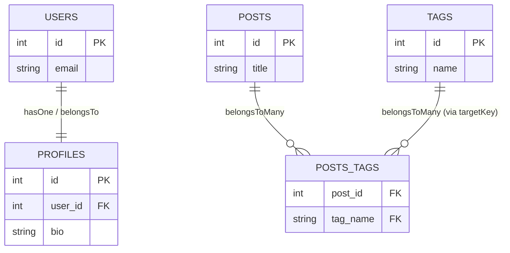

---

## Target Keys

By default, associations point to the **primary key** of the target model.  
However, in some cases you want the join to reference a different unique field. That’s what the `targetKey` option is for.  
The `targetKey` is most commonly used in `belongsToMany` associations to tell the join table which column on the target model it should reference.

### Example: many-to-many with custom `targetKey`

Here, the `posts_tags` join table will store `tag_name` values that reference the **`name` column** of the `tags` table (instead of its `id`).

```ts
db.collection({
  name: 'posts',
  fields: [
    { type: 'string', name: 'title' },
    {
      type: 'belongsToMany',
      name: 'tags',
      target: 'tags',
      through: 'posts_tags',
      sourceKey: 'id',
      foreignKey: 'post_id',
      otherKey: 'tag_name',
      targetKey: 'name', // 👈 use tag.name instead of tag.id
    },
  ],
});
db.collection({
  name: 'tags',
  fields: [{ type: 'string', name: 'name', unique: true }],
});
```

---

## Summary

* **References** let you control **foreign key behavior** with `default` and `user` priority.
* **Target Keys** let you associate models on **non-primary unique columns**.  
Together, these features extend Sequelize’s association system with more control and flexibility over schema generation and relationship mapping.

---

# Collection Inheritance

This provides a powerful collection inheritance feature that allows you to create new collections that inherit fields and associations from one or more parent collections. This is particularly useful for building complex data models and promoting reusability.  
**Note:** This feature is currently only supported for the PostgreSQL dialect.

## Basic Inheritance

To create a collection that inherits from a parent, use the `inherits` option in the collection definition.

### Example

```typescript
// Define the parent collection
const person = db.collection({
  name: 'person',
  fields: [{ name: 'name', type: 'string' }],
});
// Define the child collection
const student = db.collection({
  name: 'student',
  inherits: 'person', // or ['person']
  fields: [{ name: 'score', type: 'integer' }],
});
await db.sync();
// The 'student' collection now has both 'name' and 'score' fields.
const student1 = await student.repository.create({
  values: {
    name: 'John Doe',
    score: 95,
  },
});
```

### Visualization: Basic Inheritance

```mermaid
graph TD
  Person["Collection: person"]
  Student["Collection: student"]
  Student -->|inherits| Person
  Person -->|field| Name["name"]
  Student -->|field| Score["score"]
```

## Multiple Inheritance

A collection can inherit from multiple parents.

```typescript
db.collection({
  name: 'a',
  fields: [{ type: 'string', name: 'a1' }],
});
db.collection({
  name: 'b',
  fields: [{ type: 'string', name: 'b1' }],
});
const c = db.collection({
  name: 'c',
  inherits: ['a', 'b'],
  fields: [{ type: 'string', name: 'c1' }],
});
```

### Visualization: Multiple Inheritance

```mermaid
graph TD
  A["Collection: a"] --> C["Collection: c"]
  B["Collection: b"] --> C
  A --> A1["field: a1"]
  B --> B1["field: b1"]
  C --> C1["field: c1"]
```

## Overriding Fields and Associations

You can override fields and associations inherited from a parent collection by simply redefining them in the child collection.

```typescript
db.collection({
  name: 'person',
  fields: [
    { name: 'name', type: 'string' },
    { type: 'hasOne', name: 'profile', target: 'profiles' },
  ],
});
db.collection({
  name: 'students',
  inherits: 'person',
  fields: [
    // Override the 'profile' association to point to a different target
    { type: 'hasOne', name: 'profile', target: 'studentProfiles' },
  ],
});
```

### Visualization: Overriding Fields

```mermaid
graph TD
  Person2["Collection: person"]
  Students["Collection: students"]
  Students -->|inherits| Person2
  Person2 --> Profile["hasOne: profile -> profiles"]
  Students --> ProfileOverride["hasOne: profile -> studentProfiles"]
```

## Querying Inherited Collections

When you query a parent collection, it will also return records from its child collections. A special `__collection` field is automatically included in the results to indicate the specific collection the record belongs to.  
You can use the `__collection.$childIn` and `__collection.$childNotIn` filters to query for records of specific child types.

```typescript
// Find all records in the 'root' collection that are of type 'child1'
const records = await rootCollection.repository.find({
  filter: {
    '__collection.$childIn': ['child1'],
  },
});
```

---

# Hooks

This provides a powerful hooking system that allows you to listen for events and execute custom logic.

## Listening to Hooks

You can listen to hooks by using the `db.on()` method. The event name is a combination of the collection name and the hook name, separated by a dot.

```typescript
db.on('collectionName.hookName', (arg1, arg2, ...) => {
  // Your custom logic here
});
```

## Available Hooks

You can use any of the standard Sequelize hooks, such as:

-   `beforeValidate`
-   `afterValidate`
-   `beforeCreate`
-   `afterCreate`
-   `beforeDestroy`
-   `afterDestroy`
-   `beforeUpdate`
-   `afterUpdate`
-   `beforeSave`
-   `afterSave`
-   `beforeSync`
-   `afterSync`

### `afterCreateWithAssociations`

This is a custom hook that is triggered after a model and all of its associations have been created. This hook is executed within a transaction, so if an error is thrown within the hook, the entire creation process will be rolled back.

#### Example

```typescript
db.on('test.afterCreateWithAssociations', async (model, { transaction }) => {
  // This code runs after a 'test' model and its associations are created.
  // If this throws an error, the transaction will be rolled back.
  throw new Error('test error');
});
```

---

# Query Interface Extensions

The Query Interface provides low-level methods for interacting with the database.  
These extensions add extra functionality on top of the standard query interface, making it easier to inspect and manage database tables directly.

---

## `showTableDefinition(options)`

Retrieves the definition (schema) of a table from the database.  
This is especially useful when dealing with **reserved words** as table names (e.g., `interval`, `order`).

**Options**

- `options.tableName` *(string, required)* – The name of the table.

**Returns**  
A database-specific representation of the table’s definition (columns, constraints, etc.).

**Example**

```ts
const tableDef = await db.queryInterface.showTableDefinition({
  tableName: 'users',
});
console.log(tableDef);
// → Information about the "users" table schema
```

## `getAutoIncrementInfo(options)`

Retrieves information about an auto-incrementing column in a table.  
This is useful when you need to **inspect the current state of a sequence** (e.g., for debugging or custom migrations).

**Options**

* `options.tableInfo` *(object, required)*
  * `tableName` *(string)* – Name of the table.
  * `schema` *(string, optional)* – Schema name (PostgreSQL only).
* `options.fieldName` *(string, required)* – The name of the auto-increment column.

**Returns**

An object with:

* `currentVal` *(number)* – The current value of the sequence.
* `seqName` *(string, PostgreSQL only)* – The sequence name backing the auto-increment column.

**Example**

```ts
const incrInfo = await db.queryInterface.getAutoIncrementInfo({
  tableInfo: {
    tableName: 'users',
    schema: 'public', // PostgreSQL only
  },
  fieldName: 'id',
});
console.log(incrInfo.currentVal); // e.g. 5
console.log(incrInfo.seqName);    // e.g. "users_id_seq"
```

## `setAutoIncrementVal(options)`

Manually sets the **next value** of an auto-increment column.  
This is useful if you need to reset or advance sequences, for example, after bulk inserts, data imports, or manual ID adjustments.

**Options**

* `options.tableInfo` *(object, required)*
  * `tableName` *(string)* – Name of the table.
  * `schema` *(string, optional)* – Schema name (PostgreSQL only).
* `options.columnName` *(string, required)* – The auto-increment column name.
* `options.currentVal` *(number, required)* – The value to set as the sequence’s **next number**.
* `options.seqName` *(string, PostgreSQL only)* – The sequence name.

**Example**

```ts
await db.queryInterface.setAutoIncrementVal({
  tableInfo: {
    tableName: 'users',
    schema: 'public', // PostgreSQL only
  },
  columnName: 'id',
  currentVal: 100, // Next inserted row will start from here
  seqName: incrInfo.seqName, // Required for PostgreSQL
});
// Insert a new row, its ID will now start from 100+
```

## When to Use These Methods

* **`showTableDefinition`** → Inspect table schemas dynamically.
* **`getAutoIncrementInfo`** → Debug or check the next value of a sequence.
* **`setAutoIncrementVal`** → Reset or adjust sequences after manual operations.  
These methods are **advanced utilities**. They’re most useful in database tooling, migrations, or when you need fine-grained control over table definitions and sequences.

---

# PostgreSQL Schemas

This provides enhanced support for PostgreSQL schemas, allowing you to organize your database objects into logical groups.

## Specifying a Schema

You can specify a default schema for your database connection by providing the `schema` option when creating a new `Database` instance.

```typescript
const db = new Database({
  dialect: 'postgres',
  // ... other options
  schema: 'my_app_schema',
});
```

## Automatic Schema Creation

If the specified schema does not exist in the database, it will be automatically created when you call `db.prepare()` or `db.sync()`.

## Collection Scoping

All collections and their corresponding tables will be created within the specified schema. This helps to avoid naming conflicts and keeps your database organized.

## Cleaning a Schema

When you call `db.clean({ drop: true })`, it will drop all tables within the specified schema, effectively resetting it to a clean state.

---

# Dialect Extend

This allows you to extend its functionality by registering custom dialects. This is useful when you need to support a database that is not supported out-of-the-box, or when you want to customize the behavior of an existing dialect.

## Registering a Custom Dialect

To register a custom dialect, you need to create a class that extends `BaseDialect` and then use the `Database.registerDialect()` method.  
Your custom dialect class must have a static `dialectName` property and an `async checkDatabaseVersion(db: Database): Promise<boolean>` method.

### Example

Here is an example of how to register a custom dialect:

```typescript
import { BaseDialect, Database } from '@paybilldev/sequelize';
class SubDialect extends BaseDialect {
  static dialectName = 'test';
  async checkDatabaseVersion(db: Database): Promise<boolean> {
    return true;
  }
}
Database.registerDialect(SubDialect);
```

After registering your custom dialect, you can use it when creating a new `Database` instance by specifying the `dialectName` in the options.

---

# Miscellaneous Topics

This page covers a variety of topics and features of this custom Sequelize implementation that don't fit into the other categories.

## BigInt Support

The database has built-in support for `bigint` data types. It automatically handles the conversion between JavaScript's `BigInt` and the database's `bigint` type. When a `bigint` value is smaller than `Number.MAX_SAFE_INTEGER`, it is returned as a `number`; otherwise, it is returned as a `string`.

## Collection Factory

The `CollectionFactory` allows you to register custom collection types. This is useful for extending the functionality of collections with your own custom logic.

### Example

```typescript
class ChildCollection extends Collection {
  static type = 'child';
}
db.collectionFactory.registerCollectionType(ChildCollection, {
  condition: (options) => options.child,
});
const collection = db.collectionFactory.createCollection({
  name: 'child',
  child: true,
});
// collection is now an instance of ChildCollection
```

## Collection Importer

The `ImporterReader` class allows you to import collection definitions from a directory of files. This is a convenient way to organize your collection definitions.

```typescript
await db.import({
  directory: path.resolve(__dirname, './collections'),
});
```

## Database Operations

The `Database` class provides several useful methods:

-   `getRepository(path, sourceId)`: Gets a repository for a collection or a relation.
-   `getCollection(name)`: Gets a collection by name.
-   `hasCollection(name)`: Checks if a collection exists.
-   `on(event, listener)` / `off(event, listener)`: For listening to global and collection-specific events.

## Filtering

-   **`filterMatch(record, filter)`**: A utility function for checking if a record matches a filter object on the client-side.
-   **`FilterParser`**: A class that parses a filter object and converts it into Sequelize query parameters.

## Grouping

You can use the `group` option in `repository.find()` to group the results by one or more columns.

```typescript
const result = await repository.find({
  attributes: ['status', [db.sequelize.fn('COUNT', db.sequelize.col('id')), 'count']],
  group: 'status',
});
```

## Magic Attribute Model

The `MagicAttributeModel` is a special model that allows you to store and retrieve nested JSON data as if they were top-level attributes of the model.

-   `magicAttribute`: The name of the JSON field to use for storing the magic attributes (defaults to `'options'`).

## Migrations

The `Migrator` class provides a way to manage database schema changes over time.

-   `db.addMigrations({ directory, namespace })`: Adds migrations from a directory.
-   `db.addMigration({ name, migration })`: Adds a single migration.
-   `db.migrator.up()`: Runs all pending migrations.
-   `db.migrator.down()`: Reverts the last executed migration.

## Sorting

When sorting, `null` values are always placed last, regardless of the sort order (ASC or DESC).

## Underscored Option

The `underscored` option, which can be set at the database or collection level, controls the naming convention for tables and columns. If `true`, it will convert camelCase names to snake_case.

## Update Guard

The `UpdateGuard` class provides a way to control which fields can be updated on a model.

-   `setWhiteList(fields)`: Only allows the specified fields to be updated.
-   `setBlackList(fields)`: Prevents the specified fields from being updated.
-   `setAssociationKeysToBeUpdate(associations)`: Specifies which associations should be updated.

---